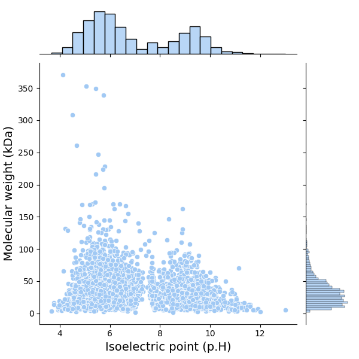
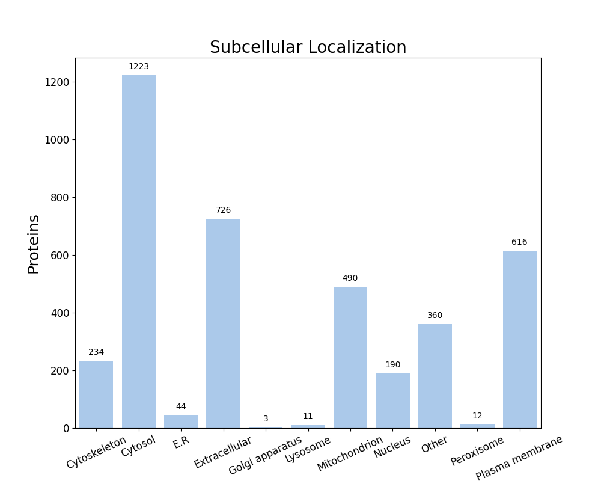

FastProtein Software 1.0
========================
##### Protein Information Software

---
### Summary
| Information                          | Value              |
| ------------------------------------ | ------------------ |
| Processed proteins                   | 3909               |
| Molecular mass (kda) mean            | 35.20 &#177; 26.94 |
| Isoelectric point mean               | 6.95 &#177; 1.83   |
| Hydrophicity mean                    | -0.06 &#177; 0.42  |
| Aromaticity mean                     | 0.08 &#177; 0.03   |
| Proteins with TM                     | 859                |
| Proteins with SP                     | 710                |
| Proteins with GPI                    | 37                 |
| Membrane proteins                    | 889                |
| Proteins with E.R Retention domains  | 468                |
| Proteins with NGlycosylation domains | 2449               |
### Molecular mass (kDa) vs Isoelectric point (pH)

---
### Subcellular localization (by WolfPSort) - Organism: animal

| Subcellular localization | Proteins |
| ------------------------ | -------- |
| Cytosol                  | 1223     |
| Extracellular            | 726      |
| Plasma membrane          | 616      |
| Mitochondrion            | 490      |
| Other                    | 360      |
| Cytoskeleton             | 234      |
| Nucleus                  | 190      |
| E.R                      | 44       |
| Peroxisome               | 12       |
| Lysosome                 | 11       |
| Golgi apparatus          | 3        |
---
### E.R Retention domain summary
| Domain | Quantity |
| ------ | -------- |
| RQEL   | 27       |
| QQEL   | 20       |
| ADEL   | 33       |
| AEEL   | 51       |
| AQEL   | 38       |
| ANEL   | 39       |
| REEL   | 28       |
| SDEL   | 32       |
| QEEL   | 23       |
| RDEL   | 46       |
Only top 10

---
### NGlyc domain summary
| Domain | Quantity |
| ------ | -------- |
| NAT    | 268      |
| NAS    | 279      |
| NLS    | 382      |
| NLT    | 327      |
| NIT    | 226      |
| NIS    | 257      |
| NVS    | 254      |
| NGT    | 204      |
| NGS    | 233      |
| NVT    | 213      |
Only top 10

---
| Id         | Length |  kDa   | Isoelectric_Point | Hydropathy | Aromaticity |  Localization   | TMHMM_2 | Phobius_TM | PredGPI | Membrane_evidences | Membrane_evidences_detail |  SignalP5   | Phobius_SP | ER_Retention_Total | NGlyc_Total | ER_Retention_Domains |                                             NGlyc_Domains                                             |                        Header                         | Local_alignment_description | Gene_Ontology | Interpro_Annotation | PFAM_Annotation | Panther_Annotation |
| ---------- |:------:|:------:|:-----------------:|:----------:|:-----------:|:---------------:|:-------:|:----------:|:-------:|:------------------:|:-------------------------:|:-----------:|:----------:|:------------------:|:-----------:|:--------------------:|:-----------------------------------------------------------------------------------------------------:|:-----------------------------------------------------:| --------------------------- | ------------- | ------------------- | --------------- | ------------------ |
| A0A384L1G8 |  212   | 23.81  |       7.99        |   -0.02    |    0.09     |  Extracellular  |    0    |     0      |    -    |         0          |                           | SP(Sec/SPI) |     Y      |         0          |      1      |                      |                                              NAS[68-71]                                               |    Thioesterase 1/protease 1/lysophospholipase L1     | -                           |               |                     |                 |                    |
| A0A3N4BCC7 |  286   | 32.46  |       5.94        |   -0.38    |    0.10     |  Cytoskeleton   |    0    |     0      |    -    |         0          |                           |      -      |     -      |         0          |      0      |                      |                                                                                                       |                Acyl-CoA thioesterase 2                | -                           |               |                     |                 |                    |
| A0A5P8YCT0 |  472   | 50.90  |       6.36        |    0.08    |    0.05     |      Other      |    0    |     0      |    -    |         0          |                           |      -      |     -      |         0          |      1      |                      |                                              NDT[80-83]                                               |                   Siroheme synthase                   | -                           |               |                     |                 |                    |
| O68691     |   87   |  9.49  |       6.53        |   -0.27    |    0.06     |     Cytosol     |    0    |     0      |    -    |         0          |                           |      -      |     -      |         0          |      3      |                      |                                    NFS[2-5];NDS[34-37];NST[67-70]                                     |    Type 3 secretion system needle filament protein    | -                           |               |                     |                 |                    |
| P17811     |  312   | 34.61  |       5.88        |   -0.54    |    0.13     |  Extracellular  |    0    |     0      |    -    |         0          |                           | SP(Sec/SPI) |     Y      |         0          |      3      |                      |                                 NIS[27-30];NQS[110-113];NYT[300-303]                                  |                 Plasminogen activator                 | -                           |               |                     |                 |                    |
| Q74Y23     |  470   | 51.66  |       6.65        |   -0.10    |    0.06     |      Other      |    0    |     0      |    -    |         0          |                           |      -      |     -      |         0          |      1      |                      |                                             NGT[406-409]                                              |                   Siroheme synthase                   | -                           |               |                     |                 |                    |
| Q8Z9S7     |  456   | 48.84  |       6.02        |   -0.06    |    0.04     |  Mitochondrion  |    0    |     0      |    -    |         0          |                           |      -      |     -      |         0          |      2      |                      |                                         NSS[2-5];NCT[322-325]                                         |               Bifunctional protein GlmU               | -                           |               |                     |                 |                    |
| Q8Z9U1     |  399   | 43.35  |       5.07        |   -0.20    |    0.08     |  Mitochondrion  |    0    |     0      |    -    |         0          |                           |      -      |     -      |         0          |      1      |                      |                                             NGS[236-239]                                              |     Enoyl-[acyl-carrier-protein] reductase [NADH]     | -                           |               |                     |                 |                    |
| Q8ZAN0     |  729   | 78.83  |       5.86        |    0.03    |    0.07     |     Cytosol     |    0    |     0      |    -    |         0          |                           |      -      |     -      |         0          |      2      |                      |                                       NTS[426-429];NES[709-712]                                       |      Fatty acid oxidation complex subunit alpha       | -                           |               |                     |                 |                    |
| Q8ZCR0     |  396   | 44.82  |       5.94        |   -0.31    |    0.10     |  Mitochondrion  |    0    |     0      |    -    |         0          |                           |      -      |     -      |         0          |      3      |                      |                                  NMS[43-46];NQS[46-49];NLS[316-319]                                   |                   Flavohemoprotein                    | -                           |               |                     |                 |                    |
| Q9X6B0     |  737   | 81.37  |       6.86        |   -0.45    |    0.10     |  Extracellular  |    0    |     0      |    -    |         0          |                           | SP(Sec/SPI) |     Y      |         0          |      0      |                      |                                                                                                       |                  Catalase-peroxidase                  | -                           |               |                     |                 |                    |
| A0A2U2GXL5 |  804   | 90.27  |       5.95        |   -0.44    |    0.07     |     Cytosol     |    0    |     0      |    -    |         0          |                           |      -      |     -      |         0          |      1      |                      |                                             NNT[177-180]                                              |                 DNA gyrase subunit B                  | -                           |               |                     |                 |                    |
| A0A380PIL6 |  851   | 93.75  |       6.92        |   -0.20    |    0.09     |  Extracellular  |    0    |     0      |    -    |         0          |                           | SP(Sec/SPI) |     Y      |         1          |      4      |    SEEL[244-248]     |                          NVT[370-373];NQS[448-451];NAS[644-647];NSS[720-723]                          |             Penicillin-binding protein 1A             | -                           |               |                     |                 |                    |
| A0A380PK62 |  423   | 49.01  |       6.48        |   -0.43    |    0.12     |     Cytosol     |    0    |     0      |    -    |         0          |                           |      -      |     -      |         0          |      4      |                      |                          NSS[110-113];NIS[204-207];NTT[255-258];NNT[346-349]                          | Trifunctional NAD biosynthesis/regulator protein NadR | -                           |               |                     |                 |                    |
| A0A380PKJ8 |  1221  | 134.06 |       5.24        |   -0.57    |    0.04     |     Nucleus     |    0    |     0      |    -    |         0          |                           |      -      |     -      |         1          |      8      |     QEEL[10-14]      | NAT[6-9];NYS[80-83];NES[415-418];NSS[629-632];NTS[644-647];NVS[669-672];NVT[1031-1034];NIS[1102-1105] |                    Ribonuclease E                     | -                           |               |                     |                 |                    |
| A0A380PMQ0 |  891   | 98.60  |       4.91        |   -0.27    |    0.05     |     Cytosol     |    0    |     0      |    -    |         0          |                           |      -      |     -      |         1          |      4      |    REEL[502-506]     |                          NGS[168-171];NLS[185-188];NIS[201-204];NTS[523-526]                          |                 DNA gyrase subunit A                  | -                           |               |                     |                 |                    |
| A0A384KQV0 |  405   | 43.63  |       6.52        |   -0.02    |    0.05     |  Mitochondrion  |    0    |     0      |    -    |         0          |                           |      -      |     -      |         0          |      3      |                      |                                NQS[211-214];NVT[231-234];NLS[240-243]                                 |  Coenzyme A biosynthesis bifunctional protein CoaBC   | -                           |               |                     |                 |                    |
| A0A3N4B351 |  573   | 61.86  |       5.80        |    0.03    |    0.06     |     Cytosol     |    0    |     0      |    -    |         0          |                           |      -      |     -      |         1          |      2      |    KQEL[529-533]     |                                       NIT[202-205];NNS[459-462]                                       |          Pyruvate dehydrogenase [ubiquinone]          | -                           |               |                     |                 |                    |
| A0A3N4BT68 |  1220  | 137.91 |       5.56        |   -0.31    |    0.08     |     Nucleus     |    0    |     0      |    -    |         0          |                           |      -      |     -      |         1          |      1      |    QDEL[154-158]     |                                            NAT[1199-1202]                                             |              RecBCD enzyme subunit RecB               | -                           |               |                     |                 |                    |
| A0A5P8YCB4 |  824   | 91.82  |       8.99        |   -0.37    |    0.08     | Plasma membrane |    0    |     1      |    -    |         2          |    PHOBIUS_TM&#124;SL     |      -      |     -      |         1          |      4      |    RQEL[421-425]     |                          NDS[151-154];NLT[257-260];NGS[546-549];NQT[749-752]                          |             Penicillin-binding protein 1B             | -                           |               |                     |                 |                    |
| A0A5P8YCE6 |  644   | 70.81  |       5.85        |   -0.25    |    0.06     |  Extracellular  |    0    |     1      |    -    |         1          |        PHOBIUS_TM         | SP(Sec/SPI) |     Y      |         0          |      3      |                      |                                 NVS[56-59];NVT[605-608];NKS[609-612]                                  |        ATP-dependent zinc metalloprotease FtsH        | -                           |               |                     |                 |                    |
| A0A5P8YKD6 |  819   | 89.11  |       5.73        |    0.06    |    0.07     |  Mitochondrion  |    0    |     0      |    -    |         0          |                           |      -      |     -      |         1          |      7      |    RQEL[521-525]     |       NIS[62-65];NAS[118-121];NGS[204-207];NTS[283-286];NVS[318-321];NLS[532-535];NTS[581-584]        |  Bifunctional aspartokinase/homoserine dehydrogenase  | -                           |               |                     |                 |                    |
| O68703     |  322   | 36.31  |       9.19        |   -0.39    |    0.11     |     Cytosol     |    0    |     0      |    -    |         0          |                           |      -      |     -      |         0          |      2      |                      |                                         NYS[13-16];NQS[57-60]                                         |                Cysteine protease YopT                 | -                           |               |                     |                 |                    |
| O69169     |  212   | 23.09  |       5.07        |   -0.12    |    0.05     |     Cytosol     |    0    |     0      |    -    |         0          |                           |      -      |     -      |         0          |      0      |                      |                                                                                                       |                  Thymidylate kinase                   | -                           |               |                     |                 |                    |
| O69172     |  214   | 23.67  |       5.36        |   -0.29    |    0.06     |     Cytosol     |    0    |     0      |    -    |         0          |                           |      -      |     Y      |         0          |      0      |                      |                                                                                                       |                   Adenylate kinase                    | -                           |               |                     |                 |                    |
| P33086     |  148   | 16.73  |       6.10        |   -0.43    |    0.05     |     Cytosol     |    0    |     0      |    -    |         0          |                           |      -      |     -      |         0          |      2      |                      |                                       NES[103-106];NHS[123-126]                                       |           Ferric uptake regulation protein            | -                           |               |                     |                 |                    |
##### Only top 10 proteins

---

##### Do you have a question or tips? Please contact us! E-mail: renato.simoes@ifsc.edu.br
Generated time: Tue Apr 07 20:05:14 UTC 2026